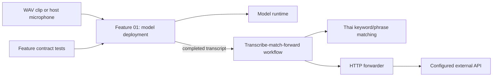

[← Back to README](../README.md)

# Architecture

The current system consists of callable feature modules, workflows, and integrations. A backend package scaffold now marks the planned HTTP boundary, but it does not yet include a running HTTP application or routes. There is no frontend. Feature contracts are maintained in the [Feature 01 specification](../.scratch/new-speech-to-text/spec.md) and [transcript matching and forwarding specification](../.scratch/transcript-matching-forwarding/spec.md).

## Backend boundary

The backend is planned as a thin HTTP adapter in the same Python process (a modular monolith). It will validate HTTP input, call existing workflow or feature interfaces, and map results to HTTP responses. It will not own transcription or matching logic.

`backend/http/` owns transport concerns only. `dependencies.py` is the composition boundary that supplies callable workflows to routes; long-lived model and session lifecycle belongs behind those workflow interfaces. Keep route schemas separate from feature inputs and outputs so the HTTP contract can evolve without changing feature contracts. The [project structure guide](project-structure.md) defines the planned backend folders and their ownership. The current scaffold reserves these package boundaries; add module files when their behavior is specified and implemented.

## Main modules

- `speech_to_text/features/model_deployment/` owns the model catalog, runtime adapters, configuration validation, audio normalization, chunking, transcription, sessions, and process topologies.
- `speech_to_text/features/word_matching/` matches configured Thai keywords and phrases in completed transcripts and counts occurrences per target.
- `speech_to_text/workflows/transcribe_match_forward/` composes Feature 01, matching, and outbound delivery for clips and per-source microphone sessions.
- `speech_to_text/integrations/http_forwarder/` posts completed transcript records to a configured HTTP endpoint and reports delivery failures to the workflow.
- `speech_to_text/backend/` is reserved for the future inbound HTTP adapter; it currently contains no server or route implementation.
- `tests/feature_01/` verifies Feature 01 callable contracts independently from any frontend or backend adapter.

## Audio and model lifecycle

The caller loads a `ModelHandle` once and passes it to one or more input flows in the owning process. The model remains loaded through all chunks until explicitly closed. A shared-model process topology sends chunks through a FIFO queue to one model-owning process; a per-input-model topology gives each input process its own model. Both modes return source-tagged events.

The transcript-match-forward workflow consumes Feature 01's completed clip transcript or ordered session events. It assembles each session by `source_id`, matches the complete transcript after its terminal event, and forwards one idempotent record per source. It does not change Feature 01's event contract. Outbound delivery retries transient failures in memory; durable delivery across process restarts is not included. The [transcript matching and forwarding specification](../.scratch/transcript-matching-forwarding/spec.md) owns the matching, payload, and configuration contracts. A future frontend/backend adapter can call these interfaces without moving feature logic into the transport layer.

Microphone capture and clip decoding are normalized inside Feature 01. Inference chunks do not overlap. Successful text is assembled in sequence order; a failed chunk emits an error and later chunks continue. Stopping a flow flushes its partial chunk before the completion event. Full event and configuration contracts live in the [Feature 01 specification](../.scratch/new-speech-to-text/spec.md).

## Local RTF measurements

Feature 01 creates one measurement for each chunk that reaches inference. RTF is `inference_seconds / audio_seconds`; each record includes process ID, source ID, sequence, status, and UTC completion timestamp. Clip responses return the records, microphone sessions publish them as events, and process-group results include their measurements. There is no database writer, historical telemetry store, host sampler, or Grafana service. See the [Feature 01 specification](../.scratch/new-speech-to-text/spec.md#per-chunk-performance-measurement) for the measurement contract.

## See also

- [Getting Started](getting-started.md) to install runtimes and call the feature modules.
- [Callable Interfaces](api.md) for the feature contracts.
