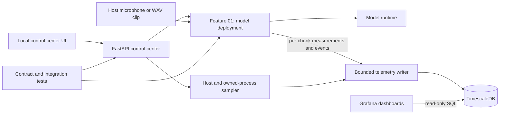

[← Back to README](../README.md)

# Architecture

The system is organized around callable feature modules. A local FastAPI control center adapts HTTP requests to those feature functions; it does not reimplement model loading, audio processing, or persistence. The feature contracts are maintained in the [Feature 01 specification](../.scratch/new-speech-to-text/spec.md) and [control center specification](../.scratch/feature-test-console/spec.md).

## Main modules

- `speech_to_text/features/model_deployment/` owns the model catalog, runtime adapters, configuration validation, audio normalization, chunking, transcription, sessions, and process topologies.
- `speech_to_text/features/feature_01_control/` adapts Feature 01 callables to HTTP routes and publishes telemetry records through the shared writer.
- `speech_to_text/control_center/` owns the local web application, explicit feature registry, shared shell, and feature page assets.
- `speech_to_text/features/system_observability/` owns the asynchronous writer, process and host sampler, schema migrations, and telemetry record contract.
- `tests/` keeps feature contract tests, control-center tests, and observability tests separate from implementation modules.

## Audio and model lifecycle

The caller loads a `ModelHandle` once and passes it to one or more input flows in the owning process. The model remains loaded through all chunks until explicitly closed. A shared-model process topology sends chunks through a FIFO queue to one model-owning process; a per-input-model topology gives each input process its own model. Both modes return source-tagged events.

Microphone capture and clip decoding are normalized inside Feature 01. Inference chunks do not overlap. Successful text is assembled in sequence order; a failed chunk emits an error and later chunks continue. Stopping a flow flushes its partial chunk before the completion event. Full event and configuration contracts live in the [Feature 01 specification](../.scratch/new-speech-to-text/spec.md#session-event-contract).

## Telemetry and RTF

Feature 01 records one measurement for each chunk that reaches inference. RTF is `inference_seconds / audio_seconds`, with process ID, source ID, sequence, and UTC completion timestamp. A bounded asynchronous writer stores records so database I/O does not block transcription. The sampler records host-wide resource totals and only the process IDs reported by registered features. Grafana reads the database through a separate read-only account. See the [System Observability specification](../.scratch/system-observability/spec.md) for the full storage contract.

## See also

- [Getting Started](getting-started.md) to run the local service.
- [API Reference](api.md) for HTTP and callable boundaries.
- [Deployment](deployment.md) for database and target-host setup.
