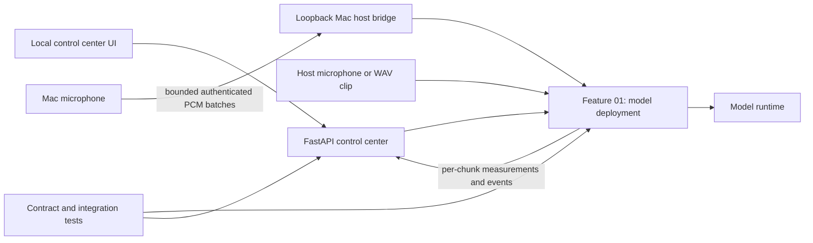

[← Back to README](../README.md)

# Architecture

The system is organized around callable feature modules. A local FastAPI control center adapts HTTP requests to those feature functions; it does not reimplement model loading, audio processing, or persistence. The feature contracts are maintained in the [Feature 01 specification](../.scratch/new-speech-to-text/spec.md) and [control center specification](../.scratch/feature-test-console/spec.md).

## Main modules

- `speech_to_text/features/model_deployment/` owns the model catalog, runtime adapters, configuration validation, audio normalization, chunking, transcription, sessions, and process topologies.
- `speech_to_text/features/feature_01_control/` adapts Feature 01 callables to HTTP routes and returns per-chunk measurements with clip and process-group results while streaming microphone measurements as events.
- `speech_to_text/control_center/` owns the local web application, explicit feature registry, shared shell, and feature page assets.
- `speech_to_text/features/mac_microphone_bridge/` captures Mac audio on the host and forwards bounded authenticated PCM batches to the Mac Docker Desktop service.
- `tests/` keeps feature contract tests and control-center tests separate from implementation modules.

## Audio and model lifecycle

The caller loads a `ModelHandle` once and passes it to one or more input flows in the owning process. The model remains loaded through all chunks until explicitly closed. A shared-model process topology sends chunks through a FIFO queue to one model-owning process; a per-input-model topology gives each input process its own model. Both modes return source-tagged events.

Microphone capture and clip decoding are normalized inside Feature 01. The Mac Docker Desktop profile captures on the Mac through a loopback host bridge that forwards authenticated PCM batches into one Feature 01 session; the feature still owns normalization, chunking, inference, and measurement creation. The Mac UI/API port is published on host interfaces, but the bridge remains loopback-only, so bridge-based microphone capture requires a browser running on the Mac. Inference chunks do not overlap. Successful text is assembled in sequence order; a failed chunk emits an error and later chunks continue. Stopping a flow flushes its partial chunk before the completion event. Full event, bridge, and configuration contracts live in the [Feature 01 specification](../.scratch/new-speech-to-text/spec.md#external-dependency-injection).

## Local RTF measurements

Feature 01 creates one measurement for each chunk that reaches inference. RTF is `inference_seconds / audio_seconds`; each record includes process ID, source ID, sequence, status, and UTC completion timestamp. Clip responses return the records, microphone sessions publish them as events, and process-group results include their measurements. There is no database writer, historical telemetry store, host sampler, or Grafana service. See the [Feature 01 specification](../.scratch/new-speech-to-text/spec.md#per-chunk-performance-measurement) for the measurement contract.

## See also

- [Getting Started](getting-started.md) to run the local service.
- [API Reference](api.md) for HTTP and callable boundaries.
- [Deployment](deployment.md) for Linux and Mac service setup.
