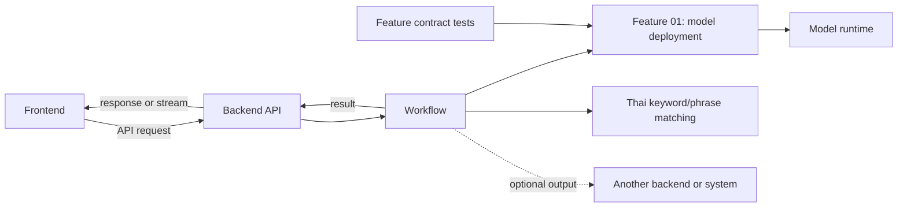

[← Back to README](../README.md)

# Architecture

The current system consists of a React frontend, a FastAPI backend API, and callable feature and workflow modules. The frontend manages saved microphone profiles, monitors workflow runs, and operates the stress-test capacity matrix through the backend API. Feature contracts are maintained in the [Feature 01 specification](../.scratch/new-speech-to-text/spec.md), [transcript matching and forwarding specification](../.scratch/transcript-matching-forwarding/spec.md), and [backend transcription API specification](../.scratch/backend-transcription-api/spec.md).

## Backend boundary

The application flow is `frontend → backend API → workflow → features`. The workflow returns results to the backend, which responds to or streams them to the frontend. A workflow can also send results to another backend or external system when its use case requires it. The backend owns a process-local run registry and bounded event buffers. Microphone workflows can either share one lazy model handle in the backend process or own a spawned input process that loads its own model.

`backend/api/` owns inbound API transport: request validation, route dispatch, and mapping workflow results to API responses. `dependencies.py` owns the process-local workflow service, executor, and run registry. `profile_store.py` persists reusable microphone workflow profiles in SQLite; run status and events remain process-local and non-durable. The workflow service owns model configuration, lazy model loading, and close lifecycle; backend routes call only its public interface. Features own domain capabilities; workflows own use-case orchestration and output choices, including outbound delivery. The [project structure guide](project-structure.md) defines folder ownership.

## Main modules

- `speech_to_text/features/model_deployment/` owns the model catalog, runtime adapters, configuration validation, audio normalization, chunking, transcription, sessions, and process topologies.
- `speech_to_text/features/word_matching/` matches configured Thai keywords and phrases in completed transcripts and counts occurrences per target.
- `speech_to_text/workflows/transcribe_match_forward/` composes Feature 01 and matching, returns results to its caller, and owns optional output delivery for clips and per-source microphone sessions.
- `speech_to_text/backend/` owns the FastAPI application, process lifecycle, inbound API routes, and HTTP schemas.
- `tests/feature_01/` verifies Feature 01 callable contracts independently from any frontend or backend adapter.

## Audio and model lifecycle

The caller can load a `ModelHandle` once and pass it to one or more input flows in the owning process, or use the per-input-model topology to give each input process its own model. Backend microphone requests expose these as `shared` and `per_workflow_process` execution modes. The workflow owns each process group and returns source-tagged events to the backend in either mode.

The transcript-match-forward workflow consumes Feature 01's completed clip transcript or ordered session events. It assembles each session by `source_id`, matches the complete transcript after its terminal event, returns results to its caller, and can forward one idempotent record per source. It does not change Feature 01's event contract. Outbound delivery retries transient failures in memory; durable delivery across process restarts is not included. The [transcript matching and forwarding specification](../.scratch/transcript-matching-forwarding/spec.md) owns the matching, payload, and output contracts.

Microphone capture and clip decoding are normalized inside Feature 01. Inference chunks do not overlap. Successful text is assembled in sequence order; a failed chunk emits an error and later chunks continue. Stopping a flow flushes its partial chunk before the completion event. Full event and configuration contracts live in the [Feature 01 specification](../.scratch/new-speech-to-text/spec.md).

## Local RTF measurements

Feature 01 creates one measurement for each chunk that reaches inference. Clip responses return the records, microphone sessions publish them as events, and process-group results include their measurements. The authoritative record fields and timing semantics are defined in the [Feature 01 specification](../.scratch/new-speech-to-text/spec.md#per-chunk-performance-measurement). Measurements are not persisted; the application has no historical telemetry store, host sampler, or Grafana service. The backend's SQLite database stores reusable microphone profiles only; run details and events remain in memory.

## See also

- [Getting Started](getting-started.md) to install runtimes and call the feature modules.
- [Callable Interfaces](api.md) for the feature contracts.
